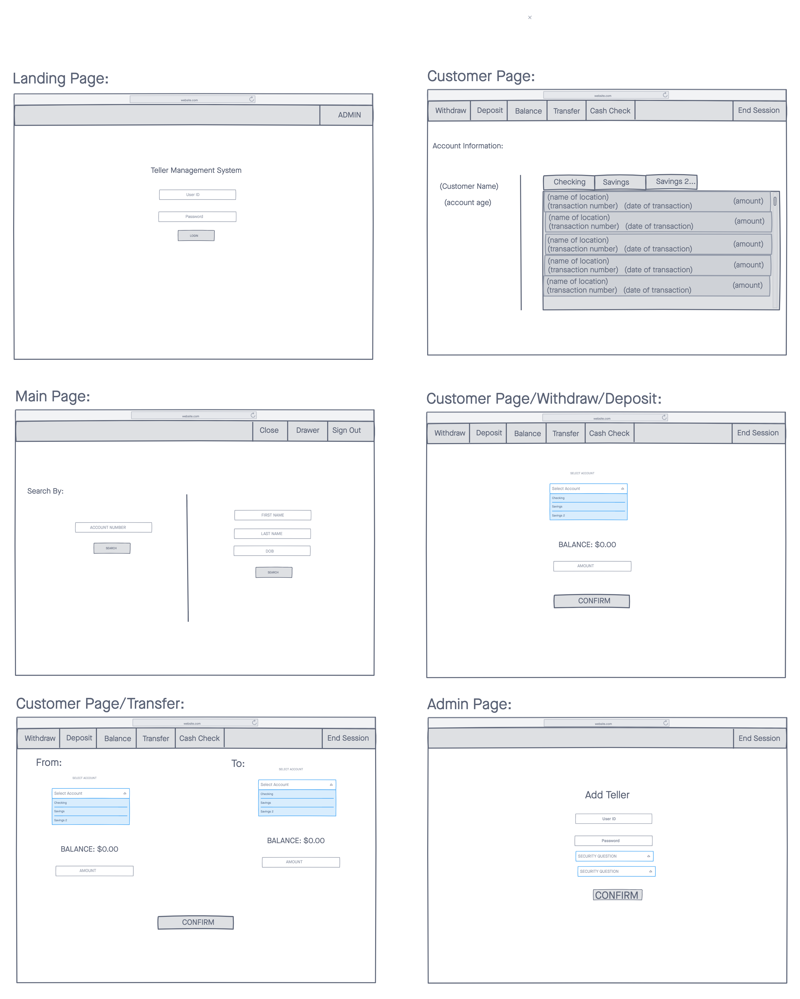
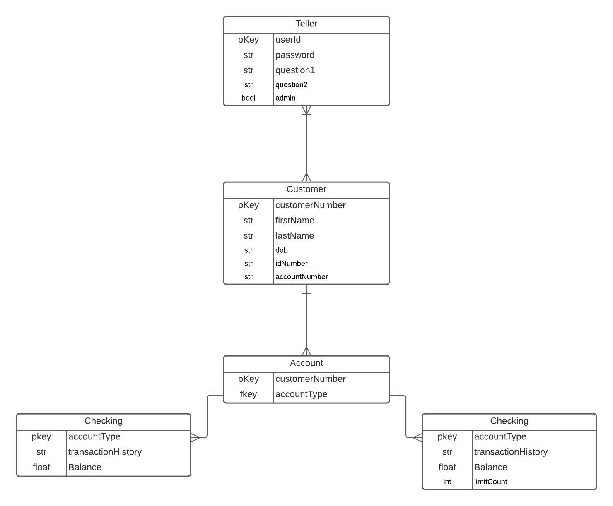

# Teller Management Syste (TMS)

Date: January 3, 2021
By: Luis Rojas-Huerta
[GitHub](https://github.com/lrojash) |
[LinkedIn](https://www.linkedin.com/in/luisrojashuerta/) |

# Description
I wanted to replicate a banking system that tellers at banks would use. I am using the system I used while I worked at as reference.

# Technologies Used

# Getting Started
The user will act as a manager with the provided userId and password. For this userId, the user will not be able to access any customer information only create tellers that will have access. This is to simulate a manager. 

# User Stories
A manager will create a an login for a teller. The teller will then be able to log in and have access to customer accounts and perform the following actions: DEPOSIT, WITHDRAW, CASH CHECK, GET BALANCE, TRANSFER.

# Wireframe

# EDR

# Trello
[Trello](https://trello.com/b/x67vNe5j/tms)